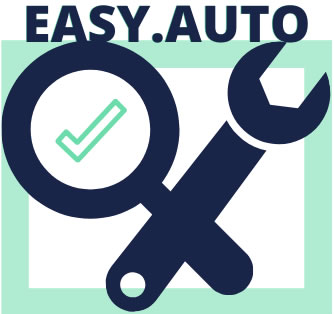

    

## Sobre o EasyAuto

A Easy.Auto surgiu através de um mapeamento das dores dos integrantes do Projeto Integrador I. Logo após a análise da pontuação das dores e votação entre os membros, realizamos a Validação da Dor utilizando o Google Forms para pesquisa entre várias pessoas do nosso ciclo social.

De acordo com a pesquisa realizada, percebemos que essa também era uma dor de muitas outras pessoas e decidimos dar continuidade ao projeto da EASY.AUTO.

Easy.Auto é um site que conecta clientes de oficinas mecânicas e lojas de vendas de peças e seus respectivos prestadores de serviços e fornecedores, abrindo a possibilidade de fazer uma pesquisa integrada, acompanhamento de orçamentos, indicação e avaliação.

## Alunos

- Alexandre Batista Amormino
- Ana Paula Scalabrini
- Gustavo Alberto Amabile Alves
- Guilherme Basilio da Silva

## Documentos

- [Apresentação do Projeto Versão 1.0](assets/documents/apresentacao-projeto-easyauto-v1.0.pdf)
- [Visão de Produto](assets/img/visao-produto-easyauto.jpeg)
- [Pesquisa para validação da dor](assets/documents/formulario-validacao-dor.docx)
- [MVP Versão 1.0](assets/documents/mvp-v1.PPTX)
- [Quadrante comparativo concorrentes](assets/documents/quadrante-comparativo-concorrentes.pptx)
- [Apresentação do Projeto Versão 2.0](assets/documents/apresentacao-projeto-easyauto-v2.0,pptx)
- [Requisitos EasyAuto](assets/documents/requisitos-easyauto.pdf)
- [Trello](https://trello.com/invite/b/c0Ok7DlD/7607e52576b22ae13db58579e328aa38/projeto-integrador-2)

## Tarefas

- [Tarefa 2 - Diagramas UML - Caso de Uso e Atividade](assets/tarefa02/)
- [Tarefa 3 - Diagramas UML - Diagrama de Classe e Objeto](assets/tarefa03/)
- [Tarefa 4 - Banco de Dados](assets/tarefa04/)
- [Tarefa 5 - Implementação Orientação a Objeto](assets/tarefa05/)
- [Tarefa 6 - Testes Unitários](assets/tarefa06/)
